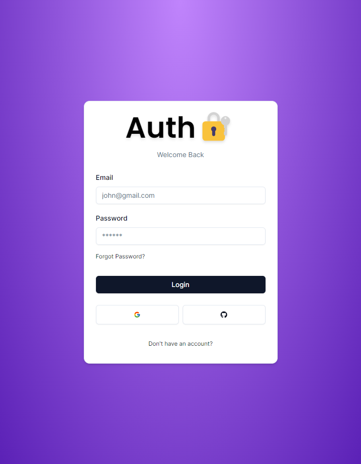
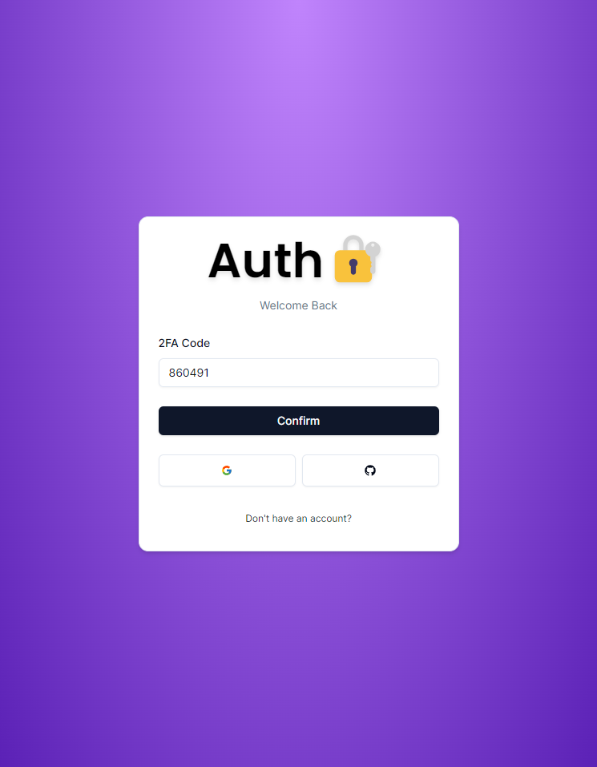
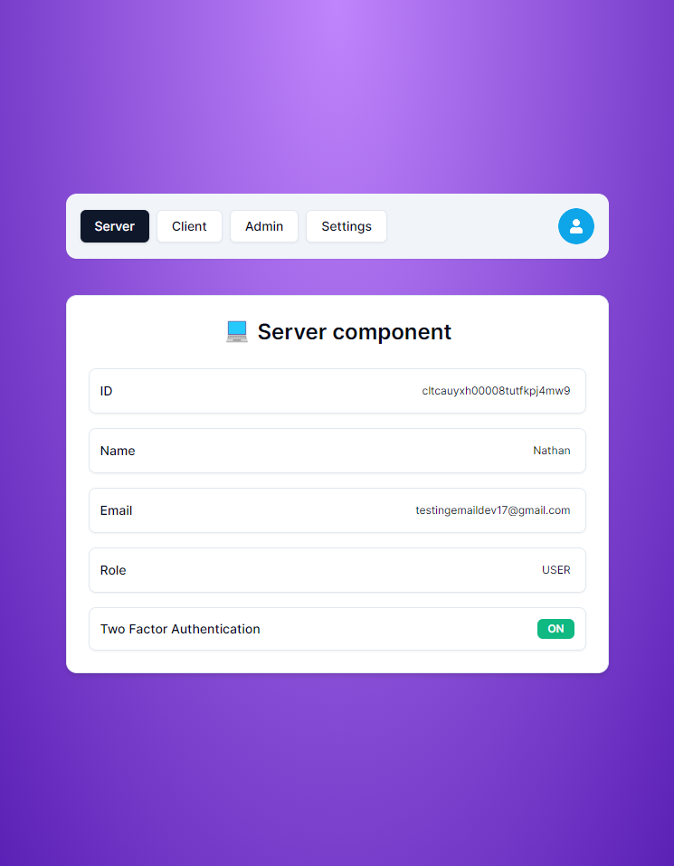
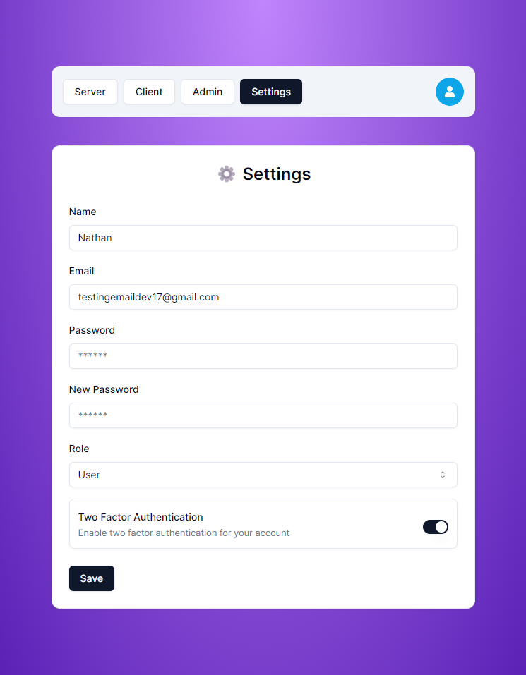

## Auth.js v5

Project using Auth.js v5

🔐 Next-auth v5 (Auth.js)
🚀 Next.js 14 with server actions
🔑 Credentials Provider
🌐 OAuth Provider (Social login with Google & GitHub)
🔒 Forgot password functionality
✉️ Email verification
📱 Two factor verification
👥 User roles (Admin & User)
🔓 Login component (Opens in redirect or modal)
📝 Register component
🤔 Forgot password component
✅ Verification component
⚙️ Dashboard to change information, and more...

